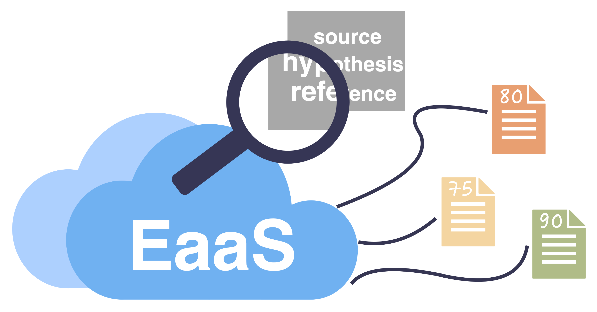

# Evaluation-as-a-Service for NLP
<p align="center">
    <br>
    
    <br>
  <a href="https://github.com/ExpressAI/eaas_client/blob/main/LICENSE"></a>
  <a href="https://github.com/expressai/eaas_client/stargazers"></a>
  <a href="https://pypi.org/project//"></a>
  <a href=".github/workflows/ci.yml"></a>
</p>


## Usage
Before using EaaS, please see the [terms of use](TERMS.md).
Detailed documentation can be found [here](https://inspired-co.github.io/eaas_client/). To install the EaaS, simply run
```bash
pip install eaas
```


## Run your "Hello, world"
A minimal EaaS application looks something like this:

```python
from eaas import Config, Client

client = Client(Config())

inputs = [{
    "source": "Hello, my world",
    "references": ["Hello, world", "Hello my world"],
    "hypothesis": "Hi, my world"
}]
metrics = ["rouge1", "bleu", "chrf"]

score_dic = client.score(inputs, metrics=metrics)


```

If `eaas` has been installed successfully, you should get the results
below by printing `score_dic`. Each entry corresponds to the metrics passed
to `metrics` (in the same order). The `corpus` entry indicates the corpus-level
score, `sample` entry is a list of sample-level scores:

 
```python
score_dic = {'scores':
     [
         {'corpus': 0.6666666666666666, 'sample': [0.6666666666666666]},
         {'corpus': 0.35355339059327373, 'sample': [0.35355339059327373]},
         {'corpus': 0.4900623006253688, 'sample': [0.4900623006253688]}
     ]
}
```

This is a list of the results 


Notably: 
* To use this API for scoring, you need to format your input as list of dictionary. 
* Each dictionary consists of `source` (string, optional), `references` (list of string, optional) and `hypothesis` (string, required). `source` and `references` are optional based on the metrics you want to use. 
* Please do not conduct any preprocessing on `source`, `references` or `hypothesis`. 
* We expect normal-cased detokenized texts. All the preprocessing steps are taken by the metrics. 
* There are other parameters that can be set in the `score` function:  `task` is the name of task (for calculating attributes), `metrics` is metric list, `lang` is the two-letter code language, `cal_attributes` is an indicator that decides whether to calculate some task-dependent attributes.
 
## Supported Metrics
Currently, EaaS supports the following metrics:
* `bart_score_en_ref`: [BARTScore](https://arxiv.org/abs/2106.11520) is a sequence to sequence framework based on pre-trained language model BART.  `bart_score_cnn_hypo_ref` uses the CNNDM finetuned BART. It calculates the average generation score of `Score(hypothesis|reference)` and `Score(reference|hypothesis)`.
* `bart_score_en_src`: [BARTScore](https://arxiv.org/abs/2106.11520) using the CNNDM finetuned BART. It calculates `Score(hypothesis|source)`.
* `bert_score_p`: [BERTScore](https://arxiv.org/abs/1904.09675) is a metric designed for evaluating translated text using BERT-based matching framework. `bert_score_p` calculates the BERTScore precision.
* `bert_score_r`: [BERTScore](https://arxiv.org/abs/1904.09675) recall.
* `bert_score_f`: [BERTScore](https://arxiv.org/abs/1904.09675) f score.
* `bleu`: [BLEU](https://aclanthology.org/P02-1040.pdf) measures modified ngram matches between each candidate translation and the reference translations. 
* `chrf`: [CHRF](https://aclanthology.org/W15-3049/) measures the character-level ngram matches between hypothesis and reference.
* `comet`: [COMET](https://aclanthology.org/2020.emnlp-main.213/) is a neural framework for training multilingual machine translation evaluation models. `comet` uses the `wmt20-comet-da` checkpoint which utilizes source, hypothesis and reference.
* `comet_qe`: [COMET](https://aclanthology.org/2020.emnlp-main.213/) for quality estimation. `comet_qe` uses the `wmt20-comet-qe-da` checkpoint which utilizes only source and hypothesis.
* `mover_score`: [MoverScore](https://arxiv.org/abs/1909.02622) is a metric similar to BERTScore. Different from BERTScore, it uses the Earth Mover’s Distance instead of the Euclidean Distance.
* `prism`: [PRISM](https://arxiv.org/abs/2004.14564) is a sequence to sequence framework trained from scratch. `prism` calculates the average generation score of `Score(hypothesis|reference)` and `Score(reference|hypothesis)`.
* `prism_qe`: [PRISM](https://arxiv.org/abs/2004.14564) for quality estimation. It calculates `Score(hypothesis| source)`.
* `rouge1`: [ROUGE-1](https://aclanthology.org/W04-1013/) refers to the overlap of unigram (each word) between the system and reference summaries.
* `rouge2`: [ROUGE-2](https://aclanthology.org/W04-1013/) refers to the overlap of bigrams between the system and reference summaries.
* `rougeL`: [ROUGE-L](https://aclanthology.org/W04-1013/) refers to the longest common subsequence between the system and reference summaries.

The default configurations for each metric can refer to this [doc](docs/default_config.md)

## Asynchronous Requests

If you want to make a call to the EaaS server to calculate some metrics and continue
local computation while waiting for the result, you can do so as follows:

```python
from eaas import Config
from eaas.async_client import AsyncClient

config = Config()
client = AsyncClient(config)

inputs = ...
req = client.async_score(inputs, metrics=["bleu"])
# do some other computation
result = req.get_result()
```